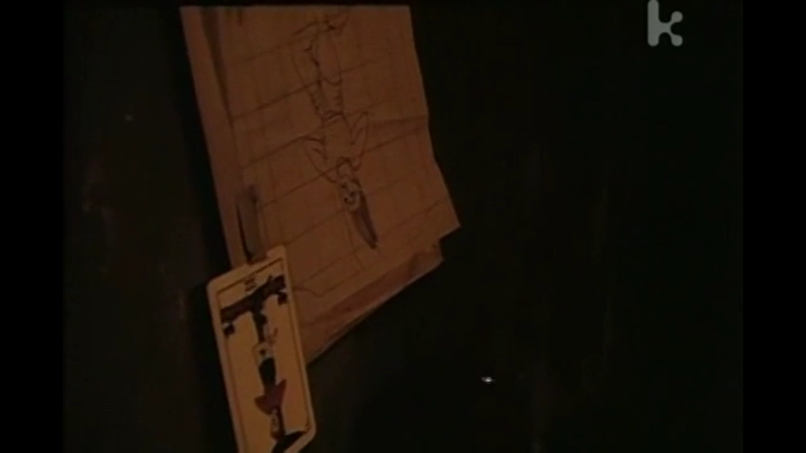
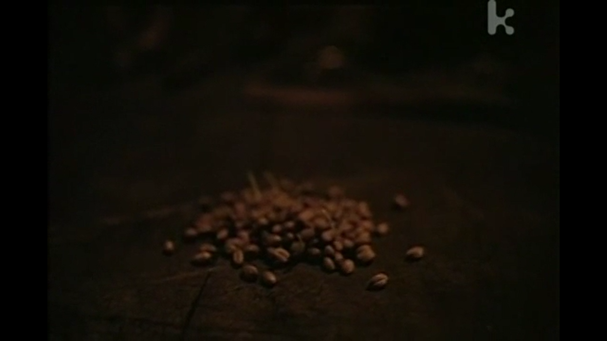
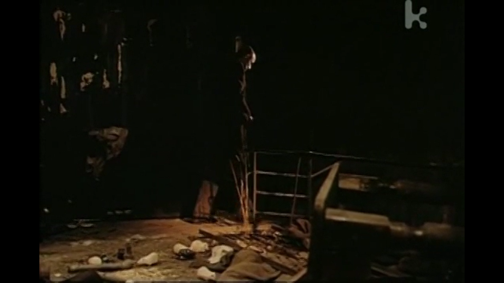

# 诵阅人偶  
影片：假人，Golem（1980，波兰）
导演：亚当·艾略特    

***

*人们悲鸟之血，却无视鱼之伤，有声音的东西是幸福的。如果人偶们也有声音，大概会大叫，不想变成人类吧。——《攻壳机动队2》*  

Golem原词为גלמי，本意是“原料”，“胚胎”或“未成之人”，往往智能低下，接收指令后便会持续执行。  

## 倒吊之人  

男子面容平静，双手反绑，倒着吊在“T”字型的树上。  
牺牲、新的观点、悬挂、因循守旧，这些是这张倒吊人塔罗牌的寓意。  
主人公普特纳就是该片的“倒吊之人”。  

他从一项主题为优化人类的实验中诞生，在“原型”普特纳接受盘问“意外”死去后，他接替了大衣，虽然不是他自己的大衣。  
因为原来的普特纳没能“成为”人，被选中作为人存在的是一位人偶，这位人偶被迫披上了人的大衣，进入了人群中。  

灰黄的光影，摇晃的镜头，开合的窗户，稀少的人群，这些元素构成了一个破败的城市光景，楼房仅仅是立在那边就已摇摇欲坠。  

在这里，警民关系高压，妓女接待盲人，影院成为宗教场所，甚至乐团也并不和谐。  

这样的环境使得普特纳于人的尊重和善意格格不入，常被人评价为“不存在于这个世界”，和那些危楼一般无处落脚。  
而他能做的也只有从善，遇到死去的警长，会为他闭上双眼。  

普特纳的状态正如那张塔罗牌上的倒吊人被悬置。  
他既超脱事外，又深陷其中，他的善意无法改变环境，却在不断的否定与孤立中显出一种异样的坚韧。  
正是在这份“倒吊”的状态中，他成为了一个被认定的“人”。  

## 萌芽新生  

*“新的生命要是萌芽，它的种子须是死的” ——《记忆的质料》*  

普特纳被认定为“人”是实验者的意外收获，一具空壳若是“骗过”了真实的人，它的一切便都具有了研究的意义，实验者们也就默认了普特纳的存在。  
而对于普特纳来说，“过去”形成养料仅仅提供了一个脆弱的落点，让他能够有一个不那么突兀的身份存在于群体中。  

实验者同“上层”被刻意隐去，留下“更好的人”这一命题，“心地善良”或许是普特纳的初始设定，但在一个暴力与猜忌主导的世界里，连最简单的善意都被视为可疑。  
管理员得知普特纳愿意借钱给自己，一度认为女儿为了钱而卖淫。  
“这本书对你肯定有帮助。”  
误会解开后，管理员这样认定，住户名单上的两个“普特纳”对于他来说，也有了改变。  
至少善意推动了一点善意，即便微弱，也仍是新生。  

两位普特纳，一位从人化为仅剩名字的空壳，另一位从仅有名字的空壳化为人。  
新生命的种子，正是早已死去的。  

## 笼中之鼠  

*当我游荡在黑暗的街头，我在那里能找到的最后陌路上，其实是在寻觅一种方式，想在保持智识自由的同时，让自己的情感也再次归属于人群。——《献给阿尔吉侬的花束》*  

实验一词透露着理性与中立，而对于小白鼠而言，或许并不一定。  
小白鼠作为明示的线索之一，于开篇便出现，成群的白鼠挤占着画面蠕动着，像是传递给观众一种信息：这场实验已被重复无数次。  

在种子长成稻时，小白鼠散落在屋内走动着，此时普特纳拥有了足够的认可去成为人，普特纳和小白鼠都从笼中逃离了……吗？  
随风开开合合的窗曾令人不寒而栗，再向那堵墙望去，窗户已不再，只留下空洞的窗孔，是时移事迁？还是另有隐情。  
他在遥望时，是「人」吗？

普特纳在他成为人的路上，只停留在这个群体。  
笔者从未使用“社会”或“城市”，一是人与人之间的交互尽显病态，很难说这些人有互相影响着；二是人员体量太小，完全达不到形成一个“城市”的规模。  

或许普特纳从始至终都只是从一个“出生”的实验箱转移到一个“成为人”的实验箱，这第二个实验箱里的所有个体，也都只是小白鼠。  

***

片末，一位戴着眼镜的发言人宣讲着政府的可靠，呼吁民众不要相信有关New Type的言论。  
这个男人手上拿着普特纳的号码牌，形似普特纳，但他会是我们一直看过来的那个普特纳吗？  

或许这位人偶的存在仅是翻阅诵读人们对「人」的期许。

在这些不确定性中，只留下：何意味？