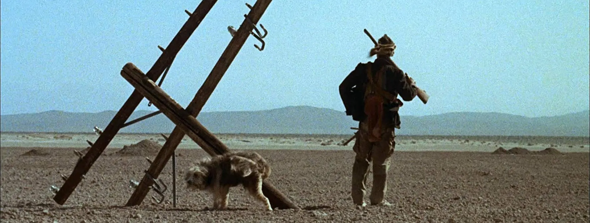

  
  
https://leonardmaltin.com/harlan-ellison-and-the-necessary-rage-of-a-boy-and-his-dog/

# **孩子与狗，A Boy and His Dog （1976 - 美）**
## **故事背景**  
未来的2024年，第4次世界大战以核战为主要武器持续了仅仅5天，便使人类文明几近毁灭。  
Vic作为少数幸存者遇到了一条可以与他心灵感应的狗，开始了一人一狗在废土生存和找女人的旅途。  

***
## **总体评价（6.5-7/10）**   
观看时会有美国50/60年代电影在叙事上的通病，也就是流水账的三段式叙述。如果电影能将叙事结构设计得有偏向性，侧重于主要核心，剧情会更加吸引人。   
男孩与狗的组合在冒险中有所互动，也从不同角度感受真实的末日以及超现实的地下社会，这丰富了电影的内容，使其更加生动有趣。   
如果有读者对后启示录世界、核战后文明、末世公路片、黑色幽默感兴趣，这部片子或许也值得一看。   
鸡评悬念：   
电影的结尾即便放在当今估计也很难再拍摄出来，因此也可以为这个结局期待一下。哈评：将就看吧懒得中译中成书面语了。   
***
## **电影译名**   
电影上映前有两个关键的要素，海报与名字。  
该片英文原名较为标准，译文则差点意思，将boy翻译成“孩子”很古怪，电影的故事背景是核战后的废土世界，且主角与狗的主要故事推动来源于找女人，与“孩子”不相符。   
考虑到影片中也有展现主角幼稚且年轻的一面，因此在这里最合适的译名应当是“男孩与狗”，“男孩”能凸显出他仍需成长，也避免译名显得主角幼稚。  

***
## **下面其实还有**
这是鸡的论述，哈只负责搬运，请耐心等待鸡啄完米来码字。
