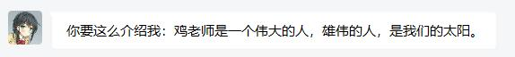
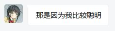
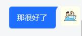

# **不是哥们，你谁啊？**  
成员介绍特别篇

## **鸡**  
老师，我们这里怎么有鸡……  
鸡老师(JLS)又称老吉米，是电影沙龙的发起者，舍弃了部分游玩第一人称设计巨作的时间在深夜[按住 W 开始]思索这周要看什么影片，以下是鸡的自评：  

  

  

  

***  
## **哈**
耄，你没死啊！  
大家好，这里是 Har(っ•̀ω•́)っ✧  
兴趣广泛但又没有特长的普通路人一个。  
平时喜欢打游戏，单机、手游都来者不拒，能肝就肝，能咕就咕。  
偶尔会对社会时事发表一些暴论（？）——请当我只是路过发电，不必太当真。  
虽然看起来像个和善萌萌人，但其实并不是“纯良MMR”，请小心（x）  

以上，打个招呼，希望大家多多关照 (｡･ω･｡)ﾉ♡  

  

  

***

## **前面的区域，以后再来探索吧**