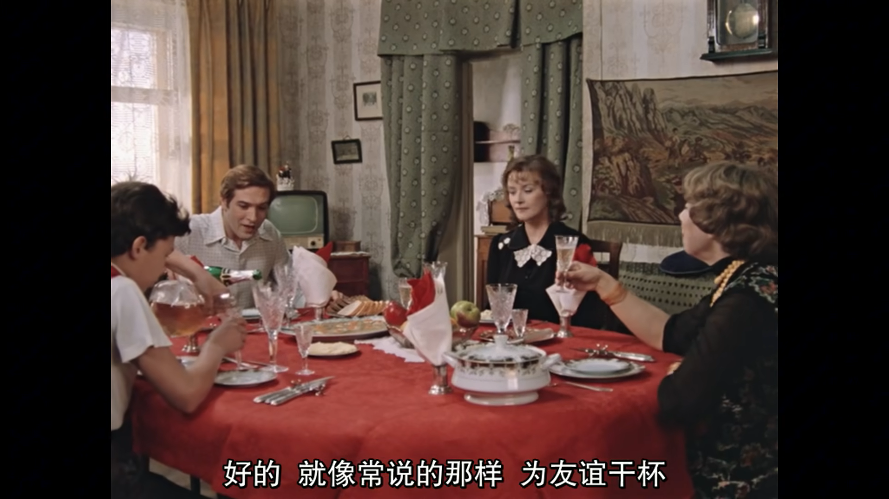
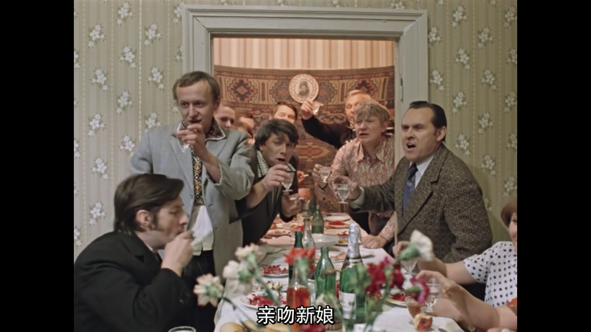
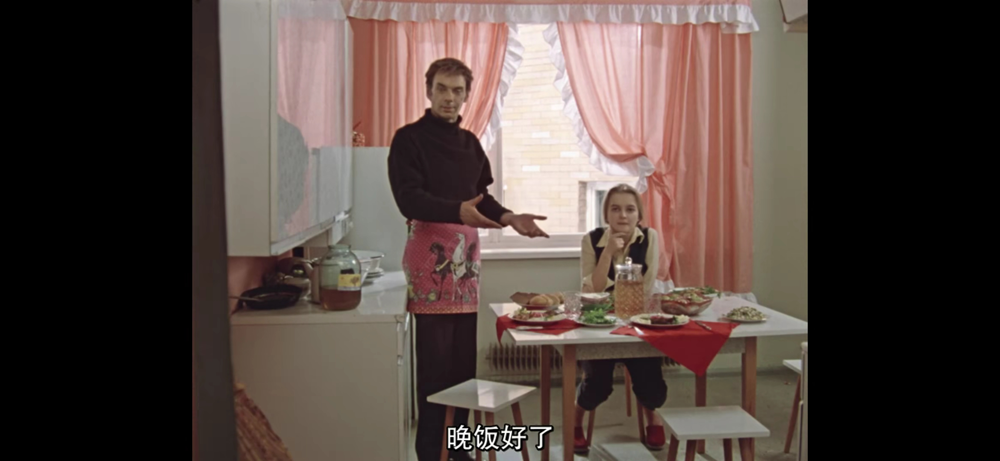

# 莫斯科不相信眼泪 Москва слезам не верит（1979, 苏）

导演：弗拉基米尔·缅绍夫  
评价者：jls，stont，amoment

***

## 鸡评（9/10）

（施工中）（后端刻：JLS你快写呀……写一半怎么发呀（））   

## stont评（9/10）

虽说是第二次观看，但仍是一部常看常新的经典之作，而这次观看的目光也从单纯的剧情对白转移到了影片中的苏联生活细节的展示和一些场景的镜头语言，这部影片在一部爱情文艺片的基础上也可以看成苏联在计划经济体制下时代飞跃的纪录片，其中展示了包含衣食住行等在苏联生活的方方面面和二十年后的变化与进步，家电、住房、汽车、衣着的不断升级以及那句自豪的：“我们有着最先进的医疗保障”，无不向观众们透露出一种优越感（老美：大家看看就好）；另一方面本片也不留余力地在文化方面展示了苏联的独特魅力，辅以穿插于其中不时让人会心一笑的斯拉夫式幽默，在物质和精神上刻画了苏联社会的运作状态，所以我认为此片完全可以作为入门苏联电影的第一部作品。

## 刻评（8.5/10）

作为我看的（也许）第一部苏系影片，它以洋溢的生活感狠狠地冲击了我，成功成为我最喜欢的文艺/剧情片之一（我真幸运）。

围绕 “生活感” 这点，电影的角色形象，情节安排以及演出方面的小巧思都有着很不错的设计。

首先谈谈角色，这部电影的角色设计让我一开始以为这是一部群像剧：它把剧中的男女都刻画的相当生动，主要角色的性格都非常鲜明。直到电影的中后期，影片演到“20年后”部分 (也许) 的时候，我才发现原来这部电影的女主是卡捷琳娜。
也许看电影时会脸盲，认不清名字，但是 “那个跟xxx在一起的xxx” 是很容易回忆起的。而且每个人的行为也都符合其性格特点，像是身边的人真的会做的样子，很有真实感。人物 (在我这里) 绝对是这部电影最出彩的点。

其次我们说情节。剧情在这部电影中显得反倒比较稀松平常了，但是又正是因为稀松平常，才更显真实。它维持住了那个 “特殊而又不特异” 的点：女主在剧中有不寻常的经历（也许可以剧透但是还是算了），
但是又不是像日本轻小说或者国内肥皂剧那样异于常人的经历，做出了惊天动地的大事那样令人感觉到不真实。情节很难独立于角色讲，但是能把每个人的故事都安排的妥妥当当，很不错了。

如果说角色是做菜时高端的材料，情节是中规中矩的厨艺，那影片中的细节就必须是那个神秘酱料了。片中大量的吃饭场景真正意义上让人感觉电影中的大家真的是在过日子：毕竟日常最重要的事大概就是吃饭了。另外剧中角色们透露出的苏式幽默也是非常地接地气，
感觉是平时会随口开的小玩笑，讲的小笑话。还有电影的配乐，分镜，调色等等，观影过程中是能体会到镜头语言的情感表达的。这里就不一一列举了。

总的来说，这是一部很好看的文艺片。只要熬过前30分钟不到的时间，了解每个角色谁是谁之后，就能很快地沉浸在故事中。绝对值得再看一遍（但是最好是有更好的中文字幕的）。

## 哈评（9/10）

事已至此，先吃饭吧。

电影拥有明确且庞大的画面信息，能够通过画面细节让观众认识到更全面的风土人情或是个人特色，于此片也是一样。

科技的浪潮下，人们每隔一段时间就要受到新奇事物的冲击，到了四十来岁，或许仍会发觉，面对这千变万化的人生，我们还是个新兵蛋子。

卡捷琳娜的人生，从乡野的恬静开始，硕果触手可及，质朴又美好。新鲜的家种水果和几块列巴，搭配上两杯酒，足够两个人交谈甚欢。

阴差阳错的，她在机遇之都莫斯科接触到了另一个平台，谁又能料到友谊会带来什么。一份奶油酱牛舌冷盘，搭配上几杯酒，足够两个人结识为伴。

而生活仍在继续，时间会推着众人到恰好的台前，不论身为主角的“你”是否乐意。莳萝泡菜，搭配上一些好酒，众人举杯庆贺，稀里糊涂地就向前行。

到头来回顾，过去或许存有诸多遗憾，也曾在深夜以泪入梦，但是晚饭好了，莫斯科不相信眼泪，要想哭请先填饱你的胃。

